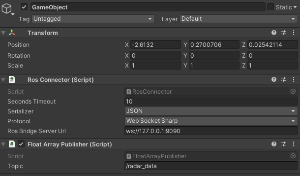

.. _sceneconfig:

***********************************
Scene Configuration
***********************************

.. _rosbridge: http://wiki.ros.org/rosbridge_suite

Radar Model
==================

The framework provides the radar sensor in Unity3D as a prefab model which can directly be imported and is linked to the radar scripts. The prefab model is found in the *Prefab* folder and is named **MainCam**. In the following, we elaborate the most important settings of the radar sensor prefab.

- **Optionselection**. Allows to transmit radar data either via ROS as a rostopic or directly via TCP/IP (e.g. for Matlab, Python, ...)
- **Fov**. Defines the field-of-view of the radar sensor in *degrees*.
- **Chirps**. Defines the number of chirps of the radar signal
- **Samples**. Defines the number of samples per radar chirp
- **Antennas**. Defines the number of receiver antennas of the radar sensor.
- **Sampling Frequency**. Defines the sampling frequency of the radar sensor in *hertz*.
- **Lower Frequency**. Defines the lower chirp frequency of the radar sensor in *hertz*.
- **Bandwidth**. Defines the bandwidth of the radar chirp in *hertz*.
- **Radiation Pattern Mask**. Defines a radiation pattern mask of the radar. Chose None if not needed.

Parameters (6)-(8) are important for correct radar operation and are often obtained in the datasheets of FMCW radar sensors.

Setting up ROS connection 
==================

To correctly set up the ROS connection to the Unity3D environment, the `rosbridge`_ package is mandatory and should be compiled in your ROS workspace.

In Unity3D, do the following

- Create a new GameObject 
- To the created GameObject, add the *Ros Connector* script which interfaces to rosbridge.
- The ROS connector needs to be configured to the rosbridge server IP address which should be configured in the field *Ros Bridge Server Url*
- Add the *Float Array Publisher* script to the GameObject and assign a topic name, e.g. *radar_data*
- Map the GameObject to the radar sensor, i.e. in the prefab model assign the GameObject to the RosConnector field.
- Launch the rosbridge server using *roslaunch rosbridge_server rosbridge_websocket.launch*
- Run the simulation. The raw data stream should now be available as a rostopic.

    Figure 1. Settings to be modified in the RosConnector GameObject.
    
Material Properties 
===================

The framework is capable of simulation wave penetration effects of non-conductive materials. To achieve this, a multi z-buffer approach was implemented in Unity, to account for penetration through objects executed in a non-conductive rendering pipeline.

To assign an object to the non-conductive rendering pipeline do the following:

- Assign a material to the object. You can either use a pre-defined material of the *Materials* folder or download/create your own one.
- Once assigned, chose the *Standard* Shader option and chose *Transparent* in the Rendering Mode tab.
